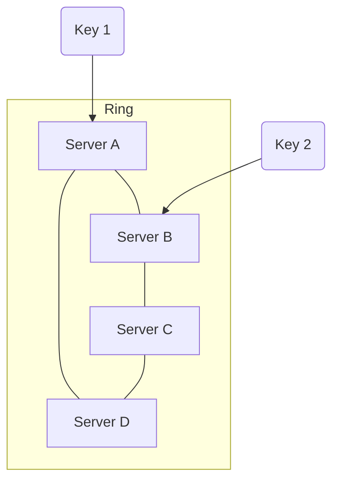

# 🔄 Consistent Hashing: Deep Dive

**Consistent Hashing** is a distributed hashing scheme that operates independently of the number of servers or objects in a distributed hash table. It powers Amazon Dynamo, Cassandra, and many CDNs.

---

## 1. The Problem (Modulo Hashing)
Standard Load Balancing uses `server = hash(key) % N`.
*   *Scenario:* You have 4 servers. Key `A` maps to Server 1.
*   *Change:* Server 5 is added. Now `N=5`.
*   *Result:* `hash(key) % 5` is completely different. **Almost 100% of keys must be moved.**
*   *Disaster:* This causes a massive "Cache Stampede" and crashes your DB.

---

## 2. The Solution: The Ring
Imagine a circle (Ring) ranges from 0 to $2^{32}-1$.

1.  **Place Servers:** Hash the server IPs to place them on the ring (Points A, B, C, D).
2.  **Place Keys:** Hash the data keys to place them on the ring.
3.  **Assign:** To find which server stores a key, go **clockwise** on the ring until you hit a server.

---

## 3. Adding/Removing Servers
*   **Adding a Server:** You place Server E between C and D. Keys that used to go to D but are now behind E act stops at E.
*   **Impact:** Only keys between C and E are moved. This is $\frac{1}{N}$ of the total data.
*   **Result:** Minimal data movement. Efficient scaling.

---

## 4. Virtual Nodes (VNodes)
*   **Problem:** If you have few servers, the gaps between them on the ring might be uneven (e.g., Server A handles 50% of the ring, Server B handles 10%).
*   **Solution:** Create "Virtual Nodes."
    *   Server A exists at 100 different points on the ring (`A_1`, `A_2`... `A_100`).
    *   Server B exists at 100 points.
*   **Benefit:** Statistically ensures uniform distribution of load.
