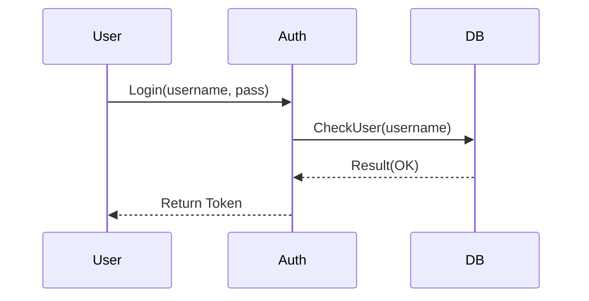

# 📐 HLD, LLD & UML: Deep Dive

Documentation is the bridge between your brain and the code.

---

## 1. HLD (High-Level Design)
*   **Goal:** To explain the system architecture to stakeholders (Managers, Architects).
*   **Focus:** Flow of data, Infrastructure, Scalability.
*   **Common Components:** Cloud Load Balancers,Databases, Caching Layers, CDN, External APIs.
*   **Deliverable:** System Architecture Diagram (Boxes and Arrows).

## 2. LLD (Low-Level Design)
*   **Goal:** To explain the implementation to developers.
*   **Focus:** Class structure, Interface definitions, Database Schema, Algorithm Logic.
*   **Common Components:** Classes, Functions, Design Patterns (Singleton, Factory, Observer).
*   **Deliverable:** Class Diagram, Sequence Diagram, Database ER Diagram.

---

## 3. UML Diagrams (Unified Modeling Language)

### Class Diagram (Structural)
*   **Shows:** The blueprint of objects.
*   **Elements:**
    *   `+ Public Method()`
    *   `- Private Variable`
    *   `Inheritance (Is-A)`
    *   `Composition (Has-A)`
*   **Use Case:** "How should I structure my Java/Python classes?"

### Sequence Diagram (Behavioral)
*   **Shows:** Interaction over time.
*   **Elements:** Lifelines (Vertical bars), Messages (Arrows).

*   **Example:**
    1.  User calls `Login()`.
    2.  AuthService calls `VerifyPassword()`.
    3.  DB returns `True`.
    4.  AuthService returns `Token`.
*   **Use Case:** "What is the exact API flow?"

### Use Case Diagram (Functional)
*   **Shows:** What the system *does* for the user.
*   **Elements:** Actors (Stick figures), Use Cases (Ovals).
*   **Example:** "Admin" (Actor) connects to "Delete User" (Use Case).
