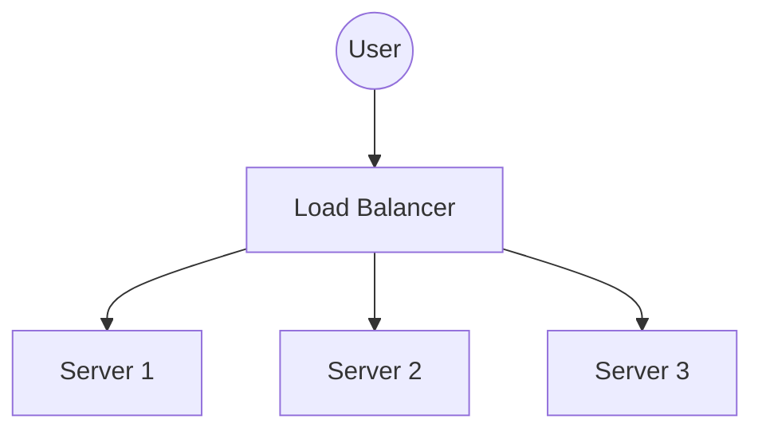

# ⚖️ Load Balancing: Deep Dive

A **Load Balancer (LB)** acts as the "Traffic Cop" sitting in front of your servers and routing client requests across all servers capable of fulfilling those requests.

---

## 1. Types of Load Balancing

### Layer 4 (Transport Layer)
*   **Metrics:** IP Address + Port (TCP/UDP).
*   **Behavior:** Doesn't look at the message content. Just forwards packets.

*   **Pros:** Extremely fast, high throughput.
*   **Cons:** "Dumb." Can't route based on URL or Cookies.
*   **Examples:** LVS, HAProxy (TCP mode).

### Layer 7 (Application Layer)
*   **Metrics:** HTTP Headers, Cookies, URL paths.
*   **Behavior:** Inspects the request. Can route `/video` to Video Servers and `/chat` to Chat Servers.
*   **Pros:** Smart routing, SSL termination, Authentication.
*   **Cons:** More CPU intensive (slower) than L4.
*   **Examples:** Nginx, AWS ALB.

---

## 2. Algorithms (The "Brains")

### Static Algorithms
1.  **Round Robin:** Circular (A -> B -> C -> A). Good for identical servers.
2.  **Weighted Round Robin:** Server B is 2x faster? Give it 2x requests (A -> B -> B -> C).
3.  **IP Hash:** `hash(ClientIP) % NumberOfServers`. Ensures a user always goes to the same server (Sticky Session).

### Dynamic Algorithms
1.  **Least Connections:** Send to server with fewest open TCP connections. Best for long tasks (e.g., file uploads).
2.  **Least Response Time:** Send to server that answers fastest.

---

## 3. Health Checks
*   **Concept:** The LB periodically pings servers ("Are you alive?").
*   **Passive:** LB notices a server failed a real user request and marks it dead.
*   **Active:** LB runs a scheduled check `/health` every 10s. If 3 checks fail, remove server from pool.

---

## 4. Redundancy
*   **Problem:** If the Load Balancer dies, the whole site is down.
*   **Solution:** Use a pair of LBs in **Active-Passive** mode using **Keepalived** (VIP - Virtual IP address moves to the backup if the primary dies).
