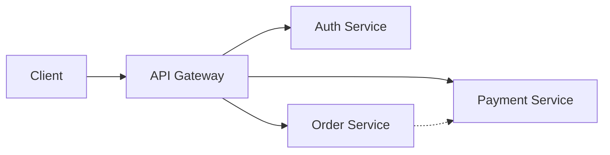

# 🧩 Microservices Architecture: Deep Dive

**Microservices** is an architectural style that structures an application as a collection of services that are highly maintainable, testable, loosely coupled, independently deployable, and organized around business capabilities.

---

## 1. Monolith vs. Microservices

### The Monolith
*   **Description:** One giant codebase (e.g., `StartUpApp.java`). All logic (Auth, Payments, Users) runs in the same process.
*   **Pros:** Easy to debug, easy to deploy (just one file), simple networking.
*   **Cons:** Tightly coupled (changing Auth might break Payments), scales poorly (you must scale the whole app, not just the busy part).

### Microservices
*   **Description:** Splitting the app into small, focused services (`AuthService`, `PaymentService`, `OrderService`).

*   **Pros:**
    *   **Independent Scaling:** Scale the `PaymentService` to 100 nodes but keep `UserService` at 2.
    *   **Tech Freedom:** Write `Auth` in Go, `Data` in Python, and `Frontend` in React.
    *   **Fault Isolation:** If `PaymentService` crashes, `UserService` typically stays up.
*   **Cons:**
    *   **DevOps Hell:** Managing 100 services is harder than managing 1.
    *   **Network Latency:** Function calls become network calls (RPC/HTTP).
    *   **Distributed Tracing:** Debugging a request that jumps through 5 services is hard.

---

## 2. Communication Patterns

### Synchronous (Direct)
*   Client -> Service A -> Service B.
*   *Protocol:* HTTP/REST, gRPC.
*   *Risk:* Cascading Failure (If B is slow, A becomes slow, Client sees timeout).

### Asynchronous (Event-Driven)
*   Client -> Service A -> Message Queue -> Service B.
*   *Protocol:* RabbitMQ, Kafka.
*   *Benefit:* Decoupling. Service A is done as soon as it drops the message. Service B picks it up when ready.

---

## 3. Data Consistency (Saga Pattern)
You cannot use ACID transactions across microservices.
*   **Saga:** A sequence of local transactions.
*   *Example:*
    1.  `OrderService`: Create Order (Pending). Publish Event.
    2.  `PaymentService`: Listen Event. Charge Card. Success? Publish `PaymentSuccess`.
    3.  `OrderService`: Listen `PaymentSuccess`. Update Order to `Confirmed`.
*   **Compensation:** If `PaymentService` fails, it publishes `PaymentFailed`. `OrderService` listens and runs a "Undo" (Compensating Transaction) to cancel the order.
